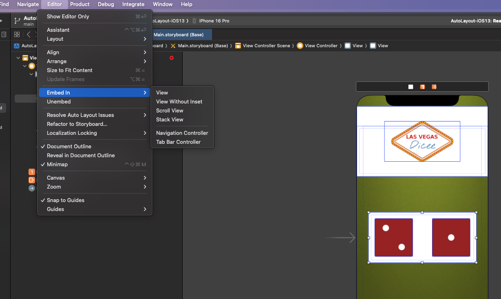
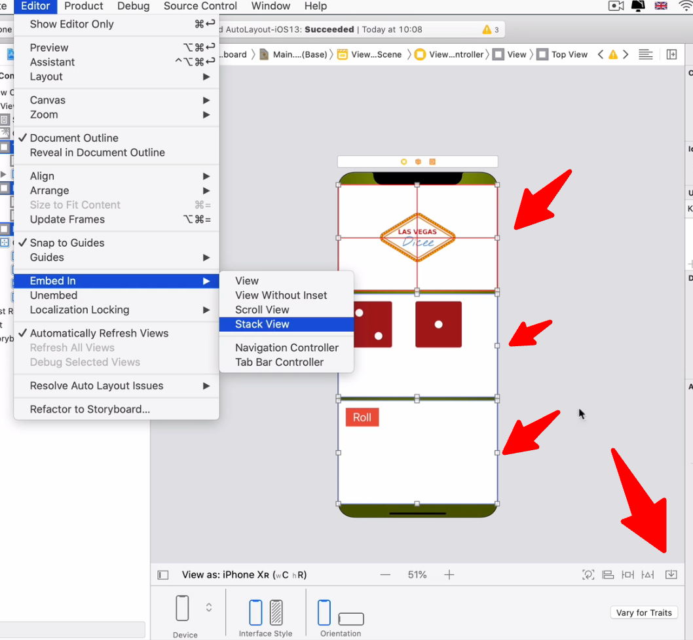

# Aligment in SwiftUI

## Constraints
- Constraints are used to define the position and size of views in SwiftUI.
- They are similar to Auto Layout constraints in UIKit.

## Alignment
- Alignment is the process of positioning views relative to each other or their parent view.
- In SwiftUI, alignment can be achieved using alignment guides, alignment frames, and alignment stacks.
- Alignment guides are used to align views along a specific axis.
- Alignment frames are used to set the alignment of a view within its parent view.
- Alignment stacks are used to group views together and align them along a specific axis.

## Pinning

- Pinning is the process of fixing a view's position relative to its parent view or other views.
- In SwiftUI, pinning can be achieved using the `padding` and `offset` modifiers.
- The `padding` modifier adds space around a view, while the `offset` modifier moves a view from its original position.
- Pinning can be used to create fixed layouts or to create responsive layouts that adapt to different screen sizes.

## Containers and Subviews
- Containers are views that hold other views, called subviews.
- In SwiftUI, containers can be created using stacks (HStack, VStack, ZStack) or other container views (List, Form, etc.).
- Containers can be used to group views together and apply layout and alignment constraints to them.
- Subviews are the individual views that are contained within a container.
- Subviews can be aligned and pinned within their parent container using alignment guides and pinning modifiers.
- Subviews can also have their own layout and alignment constraints, allowing for complex and flexible layouts.
- Containers and subviews work together to create a cohesive and organized layout in SwiftUI.

### uiView
- UIView is a class in UIKit that represents a rectangular area on the screen.
- It is the base class for all views in iOS.
- UIView is responsible for drawing content, handling touch events, and managing the view's hierarchy.
- UIView can be used to create custom views by subclassing it and overriding its drawRect method.

### Embed IN -> View

- Embedding a view in another view allows for better organization and layout of views.
- In SwiftUI, views can be embedded in other views using stacks (HStack, VStack, ZStack) or other container views (List, Form, etc.).

## Stack View

- Stack views are a type of container view that arranges its subviews in a linear or grid-like fashion.
- In SwiftUI, stack views can be created using HStack (horizontal stack), VStack (vertical stack), and ZStack (overlapping stack).