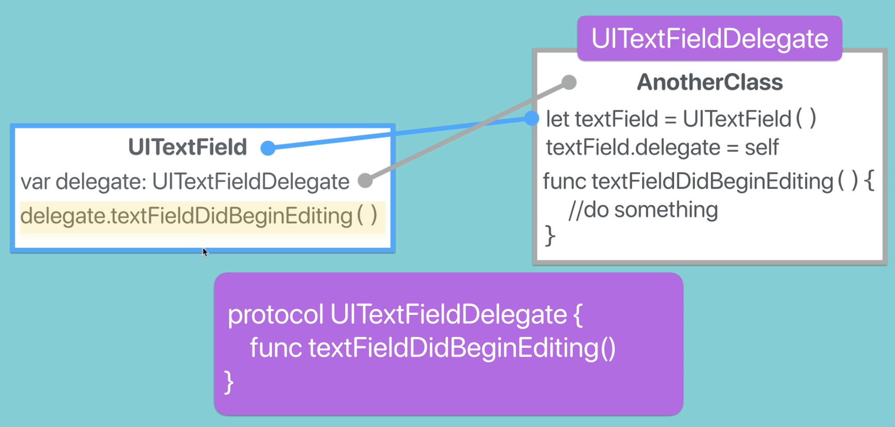

# Delegate Pattern in Swift

    The Delegate Pattern is a design pattern that allows one object to communicate with another object without needing to know the details of the other object's implementation. It is commonly used in iOS development to handle events and pass data between objects.



## Key Concepts

- **Delegation**: The process of one object (the delegate) acting on behalf of another object (the delegator). The delegator defines a protocol that the delegate must conform to, allowing it to receive callbacks and respond to events.
- **Protocol**: A blueprint of methods, properties, and other requirements that suit a particular task or piece of functionality. The delegate protocol defines the methods that the delegate must implement.
- **Delegate Object**: The object that implements the delegate protocol and responds to events or actions from the delegator.
- **Delegator Object**: The object that sends messages to the delegate. It defines the protocol and holds a reference to the delegate object.
- **Weak Reference**: The delegate reference is typically declared as a weak reference to prevent retain cycles and memory leaks. This means that the delegator does not own the delegate object, allowing it to be deallocated when no longer needed.
- **Callbacks**: The methods defined in the delegate protocol that the delegator calls to notify the delegate of events or changes.

## Example

```swift
import UIKit

// Define a protocol for the delegate
protocol CustomDelegate: AnyObject {
    func didReceiveData(data: String)
}
// Define a class that uses the delegate
class DataFetcher {
    weak var delegate: CustomDelegate?

    func fetchData() {
        // Simulate data fetching
        let data = "Hello, Delegate!"

        // Notify the delegate with the fetched data
        delegate?.didReceiveData(data: data)
    }
}
// Define a class that conforms to the delegate protocol
class ViewController: UIViewController, CustomDelegate {
    let dataFetcher = DataFetcher()

    override func viewDidLoad() {
        super.viewDidLoad()

        // Set the delegate
        dataFetcher.delegate = self

        // Fetch data
        dataFetcher.fetchData()
    }

    // Implement the delegate method
    func didReceiveData(data: String) {
        print("Received data: \(data)")
    }
}
```
In this example, the `DataFetcher` class has a delegate property of type `CustomDelegate`. The `ViewController` class conforms to the `CustomDelegate` protocol and implements the `didReceiveData(data:)` method. When the `fetchData()` method is called, it simulates fetching data and notifies the delegate by calling the `didReceiveData(data:)` method.

## Best Practices
- Use the delegate pattern for one-to-one communication between objects.
- Define clear and concise protocols to specify the methods that the delegate must implement.
- Use weak references for delegate properties to prevent retain cycles and memory leaks.
- Ensure that the delegate is set before calling any methods that rely on it.
- Consider using optional methods in the protocol to allow for flexibility in implementation.
- Document the delegate methods to provide clear guidance on their usage and expected behavior.
- Use descriptive names for delegate methods to indicate their purpose and functionality.
- Avoid using the delegate pattern for one-to-many communication; consider using notifications or closures for such cases.

## Conclusion
The Delegate Pattern is a powerful and flexible design pattern that allows for effective communication between objects in iOS development. By following best practices and using clear protocols, you can create maintainable and reusable code that adheres to the principles of object-oriented programming.

## Additional Resources
- [Apple's Delegation Documentation](https://developer.apple.com/documentation/uikit/uidelegate)
- [Swift Protocols Documentation](https://docs.swift.org/swift-book/LanguageGuide/Protocols.html)
- [Ray Wenderlich's Delegate Pattern Tutorial](https://www.raywenderlich.com/2020-delegate-pattern-in-swift)
