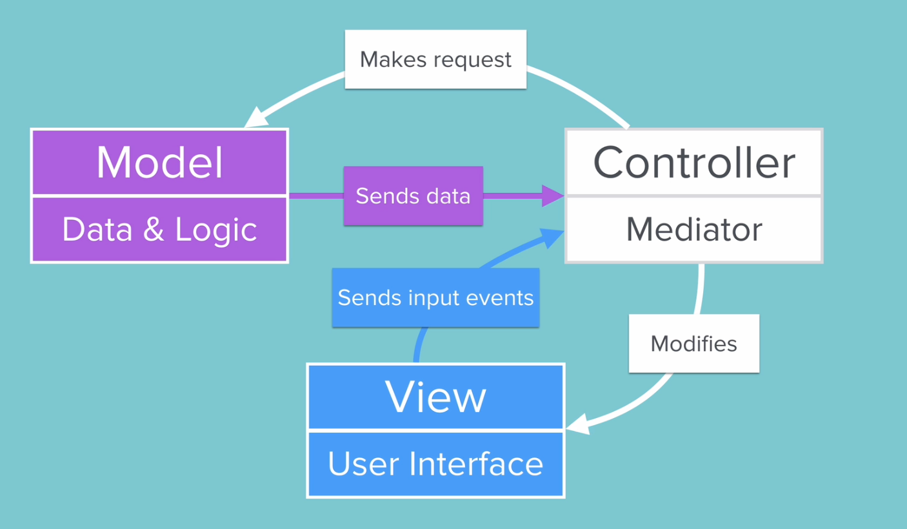

# Model View Controller (MVC) Design Pattern

## Overview
The Model-View-Controller (MVC) design pattern is a software architectural pattern that separates an application into three interconnected components:
- **Model**: Represents the data and business logic of the application. It is responsible for managing the data, including retrieving, storing, and processing it.
- **View**: Represents the user interface of the application. It displays the data from the model to the user and sends user commands to the controller.
- **Controller**: Acts as an intermediary between the model and the view. It receives user input from the view, processes it (often by updating the model), and returns the output display to the view.

