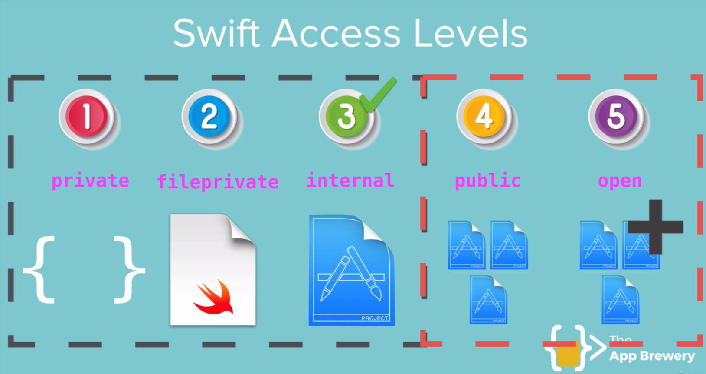

# Access Levels in Swift



Access levels in Swift determine the visibility and accessibility of classes, structures, properties, methods, and other entities within your code. Swift provides five access levels: `open`, `public`, `internal`, `fileprivate`, and `private`.

## Access Levels
- **Open**: The highest access level, allowing entities to be accessed and subclassed from any module. Open classes can be subclassed outside their defining module, and their members can be overridden.

```swift
open class OpenClass {
    open func openMethod() {
        print("This is an open method")
    }
}
// Usage
let openClassInstance = OpenClass()
openClassInstance.openMethod() // Output: This is an open method
```

- **Public**: Similar to open, but entities cannot be subclassed outside their defining module. Public classes and their members can be accessed from any module, but they cannot be overridden. This is useful when you want to expose functionality to other modules while preventing them from modifying or extending it.

```swift
// Defining a public class in a module
public class PublicClass {
    public var publicProperty: String

    public init(publicProperty: String) {
        self.publicProperty = publicProperty
    }

    public func publicMethod() {
        print("This is a public method with property: \(publicProperty)")
    }
}

// Usage in the same module
let publicClassInstance = PublicClass(publicProperty: "Hello, Public!")
publicClassInstance.publicMethod() // Output: This is a public method with property: Hello, Public!

// Usage in another module (after importing the module containing PublicClass)
// import YourModuleName
let anotherPublicInstance = PublicClass(publicProperty: "Accessible from another module")
anotherPublicInstance.publicMethod() // Output: This is a public method with property: Accessible from another module
```

In this example, the `PublicClass` and its members are accessible from any module. However, you cannot subclass `PublicClass` or override its methods outside the module where it is defined.

- **Private**: The lowest access level, restricting access to the defining class or structure. Private entities are not accessible outside their defining scope.
- **Fileprivate**: Similar to private, but allows access to entities within the same file. Fileprivate entities can be accessed by
any code in the same file, regardless of the scope.

```swift

class MyClass {
    fileprivate var myFilePrivateProperty: String = "File Private"

    private func myPrivateMethod() {
        print("This is a private method")
    }
}
// Usage
let myClassInstance = MyClass()
print(myClassInstance.myFilePrivateProperty) // Output: File Private
// myClassInstance.myPrivateMethod() // Error: 'myPrivateMethod' is inaccessible due to 'private' protection level
```

- **Internal**: The default access level, allowing entities to be accessed within the same module but not from other modules. Internal entities are accessible throughout the module where they are defined, making it suitable for most cases.

```swift
class InternalClass {
    var internalProperty: String = "Internal"

    func internalMethod() {
        print("This is an internal method")
    }
}
// Usage
let internalClassInstance = InternalClass()
internalClassInstance.internalMethod() // Output: This is an internal method
// Accessing internalProperty
print(internalClassInstance.internalProperty) // Output: Internal
```