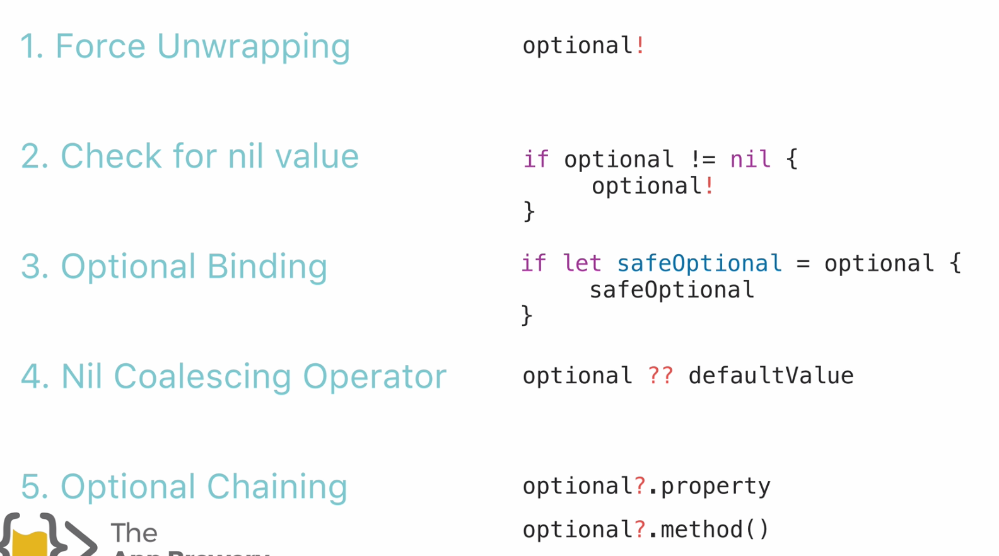

# Options in Swift

## What are Optionals?

An optional is a type in Swift that can hold either a value or `nil`, indicating the absence of a value. Optionals are used to handle situations where a value may be missing or not applicable. This is particularly useful when dealing with variables that may not have a value at all, such as when retrieving data from a database or network request.

## Declaring Optionals
You declare an optional by appending a question mark (`?`) to the type of the variable. For example:

```swift
var name: String? // This variable can hold a String or nil
```
You can also declare optionals with an exclamation mark (`!`) to indicate that the variable is implicitly unwrapped. This means that you are certain that the variable will have a value when you use it, and you don't need to check for nil:

```swift
var name: String! // This variable can hold a String or nil, but will be unwrapped automatically when used
```
## Using Optionals
You can assign a value to an optional variable like this:

```swift
var name: String? = "Alice"
```
You can also assign `nil` to an optional variable:

```swift
name = nil
```



## 1 Force Unwrapping Optionals

To access the value of an optional, you need to unwrap it. You can do this using the force unwrapping operator (`!`). However, be cautious when using this operator, as it will crash your program if the optional is `nil`:

## 2 Check for nil value

```swift
var name: String? = "Alice"
if name != nil {
    print("Name is \(name!)") // Force unwrapping
} else {
    print("Name is nil")
}
```

## Optional Binding

Optional binding is a safer way to unwrap optionals. You can use `if let` or `guard let` to check if an optional has a value and safely unwrap it:

```swift
var name: String? = "Alice"
if let unwrappedName = name {
    print("Name is \(unwrappedName)") // Safely unwrapped
} else {
    print("Name is nil")
}
```

## 4 Nil Coalescing Operator `??`

The nil coalescing operator (`??`) allows you to provide a default value if an optional is `nil`. This is useful for providing fallback values:

```swift
var name: String? = nil
let unwrappedName = name ?? "Default Name"
print("Name is \(unwrappedName)") // "Default Name"
```

## 5 Optional Chaining

Optional chaining allows you to call properties, methods, and subscripts on optional that might currently be nil. If the optional is nil, the call fails gracefully without crashing:

```swift
var name: String? = "Alice"
let length = name?.count // length is an optional Int
print("Length is \(length ?? 0)") // "Length is 5"
```