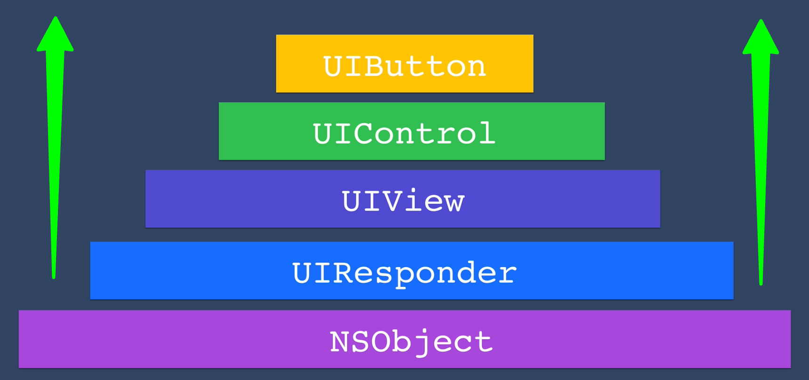

# Classes & Inheritance in Swift

## Example of Earache of Child

UIButton -> UIControl -> UIView -> UIResponder -> NSObject

## NSObject
NSObject is the root class of most Objective-C class hierarchies
and is the default root class for Swift classes. It provides basic object behavior and is the base class for most Cocoa classes.

NSObject -> UIResponder -> UIView -> UIControl -> UIButton

## UIResponder

UIResponder is the base class for objects that respond to and handle events. It provides methods for handling touch events, motion events, and remote control events.
It is the superclass of UIView and UIViewController.

UIResponder -> UIView -> UIControl -> UIButton

## UIView

UIView is the base class for all views in iOS. It provides the basic functionality for drawing and handling touch events.
It is the superclass of all visual elements in iOS, including buttons, labels, and images.

UIView -> UIControl -> UIButton

## UIControl

UIControl is the base class for all controls in iOS. It provides the basic functionality for handling user interactions and events.
It is the superclass of all controls in iOS, including buttons, sliders, and switches.

UIControl -> UIButton

