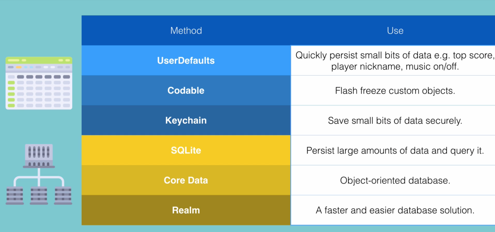

# Saving Data in iOS

## 1. UserDefaults
UserDefaults is a simple way to store small amounts of data persistently across app launches. It is typically used for storing user preferences, settings, and other lightweight data.
- UserDefaults allows you to store data in key-value pairs.
- You can store various data types, including strings, numbers, booleans, arrays, and dictionaries.

## 2. Codable

Codable is a protocol in Swift that allows you to easily encode and decode data types to and from various formats, such as JSON and Property Lists (Plist). It is commonly used for serializing and deserializing data in iOS applications.
- Codable is a combination of two protocols: Encodable and Decodable.
- Encodable allows you to convert your data types into a format that can be stored or transmitted (e.g., JSON).
- Decodable allows you to create instances of your data types from a serialized format (e.g., JSON).

## 3. Keychain

The Keychain is a secure storage mechanism provided by iOS for storing sensitive data, such as passwords, encryption keys, and other confidential information. It is designed to keep this data safe and accessible only to the app that created it.
- The Keychain uses strong encryption to protect the data stored within it.
- It is suitable for storing sensitive information that needs to be securely shared between app launches.

## 4. SQLite

SQLite is a lightweight, embedded database engine that allows you to store and manage structured data in your iOS applications. It is commonly used for applications that require complex data storage and retrieval operations.
- SQLite provides a full-featured SQL interface for querying and manipulating data.
- It is suitable for applications that need to handle large amounts of data or complex relationships between data entities.

## 5. Core Data

Core Data is a powerful framework provided by iOS for managing the model layer of your application. It allows you to work with complex data models, relationships, and object graphs.
- Core Data provides an object-oriented interface for managing data, making it easier to work with complex data structures.
- It supports features like data validation, change tracking, and undo/redo functionality.
- Core Data can be used with various persistent stores, including SQLite, XML, and binary formats.

## 6. Realm

Realm is a modern, object-oriented database that provides an alternative to Core Data and SQLite for data storage in iOS applications. It is designed to be easy to use and offers high performance for data operations.
- Realm allows you to define your data models as Swift classes, making it easy to work with your data in a natural way.
- It provides a simple API for querying and manipulating data, making it suitable for both small and large datasets.

