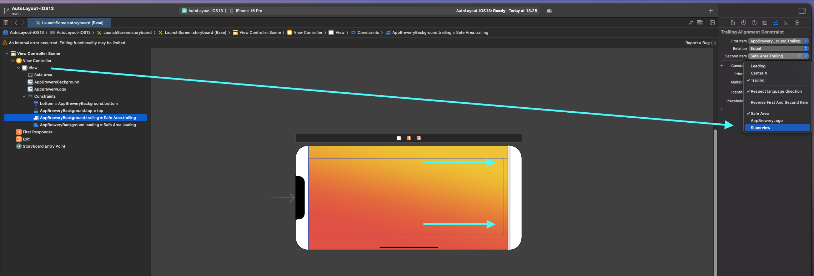

# X code main info

## View Controller

- View controller is a class that manages a view in an iOS app.
- It is responsible for the view's lifecycle, including loading, appearing, disappearing, and unloading.
- View controllers are the building blocks of an iOS app's user interface.

### View in view controller (Super View)

- A view is a rectangular area on the screen that displays content.

