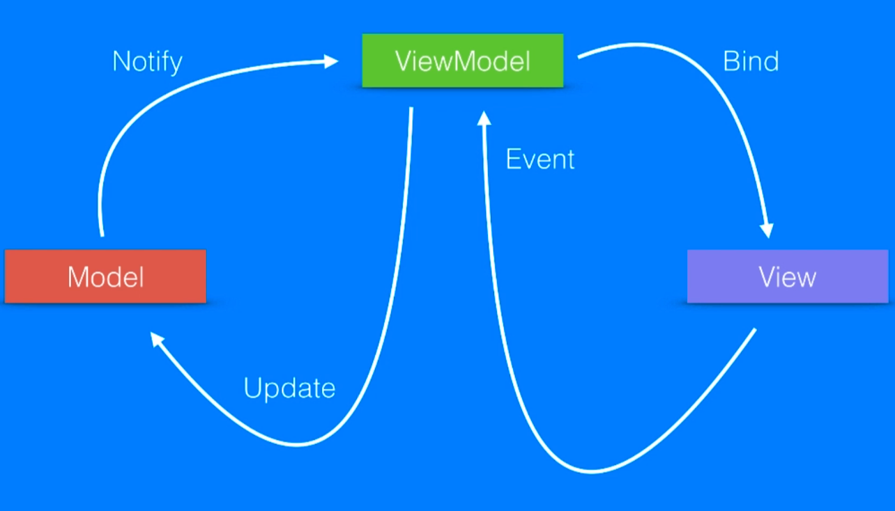

# MVVM (Model-View-ViewModel) Design Pattern

    The MVVM design pattern is a software architectural pattern that separates the representation of information from the user's interaction with it. It is commonly used in applications to enhance testability, maintainability, and separation of concerns.

## Key Components
- **Model**: Represents the data and business logic of the application. It is responsible for managing the data, including fetching, storing, and processing it.
- **View**: Represents the user interface of the application. It displays the data from the model and sends user interactions to the view model.
- **ViewModel**: Acts as an intermediary between the model and the view. It retrieves data from the model, processes it, and exposes it in a format that the view can easily consume. It also handles user interactions and updates the model accordingly.

## Why Use MVVM?

- **Separation of Concerns**: MVVM separates the user interface logic from the business logic, making it easier to manage and test.
- **Testability**: The view model can be tested independently of the view, allowing for unit tests to ensure the correctness of the business logic.
- **Data Binding**: MVVM often uses data binding to automatically synchronize the view with the view model, reducing boilerplate code and improving responsiveness.