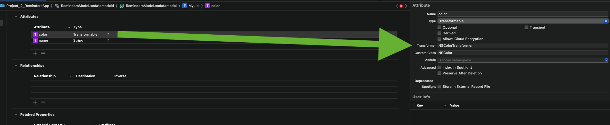

# NSColorTransformer

Problem: Core Data does not support the `NSColor` type directly, so colors cannot be stored.
Solution: To store colors in Core Data, we can use a Value Transformer that converts `NSColor` to `Data` and back.



## NSColorTransformer

1. Create a class `NSColorTransformer` that inherits from `ValueTransformer`.
2. Override the `transformedValueClass` method to specify that the transformed type is `Data`.
3. Implement the `transformedValue` method to convert `NSColor` to `Data` using `NSKeyedArchiver`.
4. Implement the `reverseTransformedValue` method to convert `Data` back to `NSColor` using `NSKeyedUnarchiver`.

```swift
import Foundation
import AppKit

class NSColorTransformer: ValueTransformer {
    override func transformedValue(_ value: Any?) -> Any? {

        guard let color = value as? NSColor else { return nil }

        do {
            let data = try NSKeyedArchiver.archivedData(withRootObject: color, requiringSecureCoding: true)

            return data
        } catch {
            return nil
        }
    }


    override func reverseTransformedValue(_ value: Any?) -> Any? {
        guard let data = value as? Data else { return nil }

        do {
            let color = try NSKeyedUnarchiver.unarchivedObject(ofClass: NSColor.self, from: data)
            return color
        } catch {
            return nil
        }
    }
}

// Register the transformer

ValueTransformer.setValueTransformer(NSColorTransformer(), forName: NSValueTransformerName("NSColorTransformer"))
```