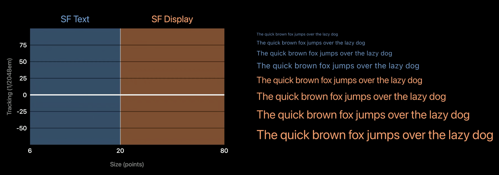

# Fonts in SwiftUI

# [Apple link](https://developer.apple.com/videos/play/wwdc2024/10151/)

[San Francisco font family](https://developer.apple.com/videos/play/wwdc2022/110381/)

# Overview

## Font Families

- Condensed
- Compressed
- Regular
- Expanded

## SFText VS SFDisplay
- SFText is used for body text and smaller text elements.
- SFDisplay is used for larger text elements, such as headings and titles.
